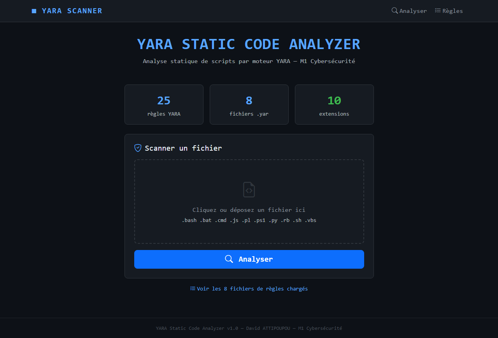
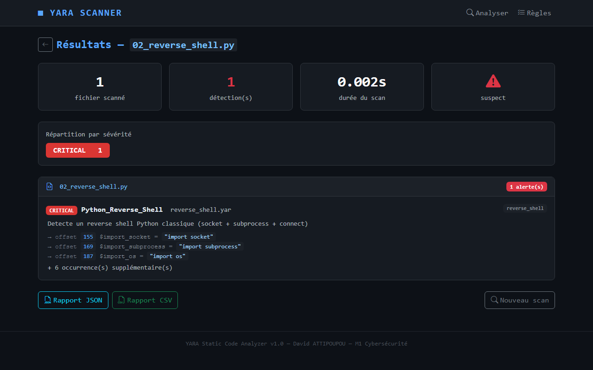
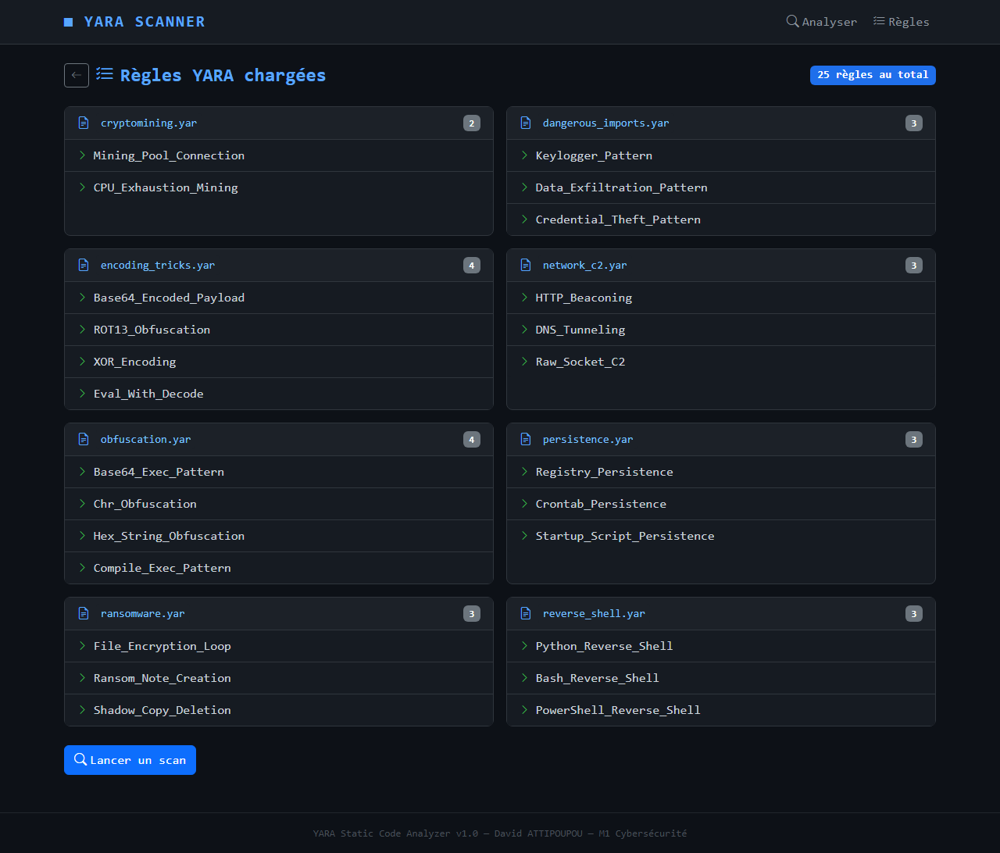

# 🔍 YARA Static Code Analyzer
### Projet Annuel — David ATTIPOUPOU — M1 Cybersécurité

Outil d'**analyse statique** de code s'appuyant sur le moteur **YARA** pour détecter
des scripts potentiellement malveillants (Python, Bash, PowerShell, JavaScript…).

> ⚠️ **Analyseur strictement statique.** Le code examiné n'est **jamais exécuté** :
> toute détection se fait par lecture des fichiers et application de règles YARA,
> complétées par une analyse statistique d'entropie.

---

## ✨ Fonctionnalités

- **Moteur YARA** — 25 règles réparties en 8 familles (obfuscation, reverse shells,
  imports dangereux, encodage, C2 réseau, persistance, ransomware, cryptominage).
- **Détection avancée par entropie de Shannon** — repère les charges utiles
  encodées/chiffrées même sans règle dédiée.
- **Score de risque et verdict par fichier** — score brut cumulé, risque normalisé
  sur 100, et verdict lisible (PROPRE / À VÉRIFIER / SUSPECT / MALVEILLANT).
- **Rapports JSON et CSV** — avec empreinte **SHA-256** de chaque fichier analysé
  (identification d'échantillon, corrélation VirusTotal…).
- **Interface CLI** colorée + **interface web Flask** optionnelle (upload et scan).
- **Code de sortie CI/CD** — le scan renvoie `1` si une menace est détectée,
  `0` sinon : directement intégrable dans un pipeline.
- **Architecture modulaire** (`core/`) et **suite de tests** pytest (31 tests).

---

## 🚀 Installation (Windows / Mac / Linux)

1. Installer **Python 3.10+** (sur Windows, cocher « Add Python to PATH »).
2. Installer les dépendances :

```bash
pip install -r requirements.txt
```

> Le chemin CLI de base ne nécessite que `yara-python` (et `colorama` pour les
> couleurs). `flask` n'est requis que pour l'interface web, `pytest` que pour les tests.

---

## 🖥️ Utilisation (CLI)

```bash
# Scanner un dossier
python scanner.py --scan test_samples/

# Scanner un fichier unique
python scanner.py --scan script_suspect.py

# Générer un rapport JSON ou CSV (dans reports/)
python scanner.py --scan test_samples/ --report json
python scanner.py --scan test_samples/ --report csv

# Lister toutes les règles YARA chargées
python scanner.py --list-rules

# Utiliser une base de règles personnalisée
python scanner.py --scan test_samples/ --rules /chemin/vers/mes_regles

# Ne garder que les détections graves (réduit le bruit)
python scanner.py --scan test_samples/ --min-severity HIGH

# Désactiver la détection par entropie (YARA seul)
python scanner.py --scan test_samples/ --no-entropy

# Afficher la version
python scanner.py --version
```

| Option | Effet |
| --- | --- |
| `--scan CIBLE` | Fichier ou dossier à analyser. |
| `--rules DOSSIER` | Base de règles YARA à utiliser (défaut : `rules/`). |
| `--min-severity NIVEAU` | Filtre : n'affiche que `≥ CRITICAL/HIGH/MEDIUM/LOW/INFO`. |
| `--report {json,csv}` | Génère un rapport dans `reports/`. |
| `--list-rules` | Liste les règles chargées. |
| `--no-entropy` | Désactive l'analyse par entropie. |
| `--no-banner` | Masque la bannière ASCII. |
| `--version` | Affiche la version. |

### Détection par entropie

En complément des règles YARA, le scanner mesure l'entropie de Shannon des longues
chaînes : les charges utiles encodées/chiffrées (entropie élevée, proche de
l'aléatoire) sont repérées même sans motif connu.

### Code de sortie

Le scanner renvoie `1` dès qu'au moins un fichier est suspect, `0` sinon — pratique
pour bloquer un job d'intégration continue :

```bash
python scanner.py --scan ./src && echo "Aucune menace"
```

---

## 🤖 Module ML comportemental (bonus, optionnel)

En complément de YARA et de l'entropie, un classifieur **scikit-learn**
(RandomForest) apprend à distinguer scripts bénins et malveillants à partir
de caractéristiques **statiques** globales (entropie, densité de mots-clés
suspects, longueur des lignes, imports dangereux…). Il peut lever un doute
sur un script qu'aucune règle ne matche.

```bash
# 1. Installer les dépendances ML (isolées : la CLI de base n'en a pas besoin)
pip install scikit-learn joblib

# 2. Entraîner le modèle sur le dataset (test_samples/) — évaluation par
#    validation croisée puis sauvegarde dans models/
python train_ml.py

# 3. Ajouter l'analyse ML à un scan
python scanner.py --scan test_samples/ --ml
```

Le module est **totalement optionnel** : sans scikit-learn, la CLI YARA
fonctionne normalement et `--ml` affiche un message d'indisponibilité clair.

> ⚠️ Dataset volontairement réduit (usage pédagogique) : les probabilités
> affichées sur les fichiers d'entraînement sont optimistes. La validation
> croisée donne une estimation plus honnête de la généralisation.

---

## 🌐 Interface web (optionnelle)

```bash
pip install flask
python app.py         # → http://localhost:5000
```

Permet d'uploader **un ou plusieurs** scripts, de les scanner et de télécharger
le rapport JSON/CSV. Le dossier `uploads/` est purgé avant chaque scan (pas
d'accumulation d'échantillons potentiellement malveillants).

| Accueil | Résultats | Règles |
| --- | --- | --- |
|  |  |  |

---

## 🧪 Tests

```bash
pip install pytest
python -m pytest tests -q
```

Deux garanties de non-régression :
- **aucun** fichier de `test_samples/clean/` ne doit être flaggé (zéro faux positif) ;
- **tous** les fichiers de `test_samples/malicious/` doivent être détectés.

---

## 📁 Structure du projet

```
yara_scanner/
├── scanner.py              # Point d'entrée CLI (orchestrateur léger)
├── app.py                  # Interface web Flask (optionnelle)
├── train_ml.py             # Entraînement du modèle ML (bonus)
├── core/                   # Logique métier modulaire
│   ├── config.py           # Constantes (chemins, extensions, sévérités)
│   ├── rule_loader.py      # Chargement / compilation des règles YARA
│   ├── engine.py           # Moteur de scan (classe YaraScanner)
│   ├── entropy.py          # Détection avancée par entropie de Shannon
│   ├── scoring.py          # Score de risque et verdict par fichier
│   ├── hashing.py          # Empreintes SHA-256 des fichiers
│   ├── reporting.py        # Génération des rapports JSON / CSV
│   ├── features.py         # Extraction de features statiques (ML)
│   ├── ml.py               # Classifieur comportemental (ML, optionnel)
│   └── display.py          # Couche présentation terminal (couleurs)
├── models/                 # Modèle ML entraîné (behavioral_model.joblib)
├── rules/                  # 8 fichiers de règles YARA (25 règles)
│   ├── obfuscation.yar         ├── network_c2.yar
│   ├── reverse_shell.yar       ├── persistence.yar
│   ├── dangerous_imports.yar   ├── ransomware.yar
│   └── encoding_tricks.yar     └── cryptomining.yar
├── templates/              # Vues HTML de l'interface web
├── test_samples/
│   ├── clean/              # Scripts légitimes (Python, PowerShell, Bash, JS)
│   └── malicious/          # Scripts malveillants de test
├── tests/                  # Suite pytest de non-régression
├── reports/                # Rapports générés (JSON / CSV)
└── requirements.txt
```

---

## 🧩 Architecture (modules cibles)

| Module | Rôle |
| --- | --- |
| `rule_loader` | Recherche, compilation et inventaire des règles YARA. |
| `engine` | Parcourt fichiers/dossiers et applique les règles. |
| `entropy` | Détection avancée : obfuscation, contenu encodé/chiffré. |
| `scoring` | Score de risque normalisé et verdict par fichier. |
| `reporting` | Rapports JSON/CSV avec SHA-256, sévérité, règle déclenchée. |
| `features` + `ml` | Détection comportementale ML complémentaire (bonus). |
| `display` | Interface CLI colorée ; interface web Flask (`app.py`). |
